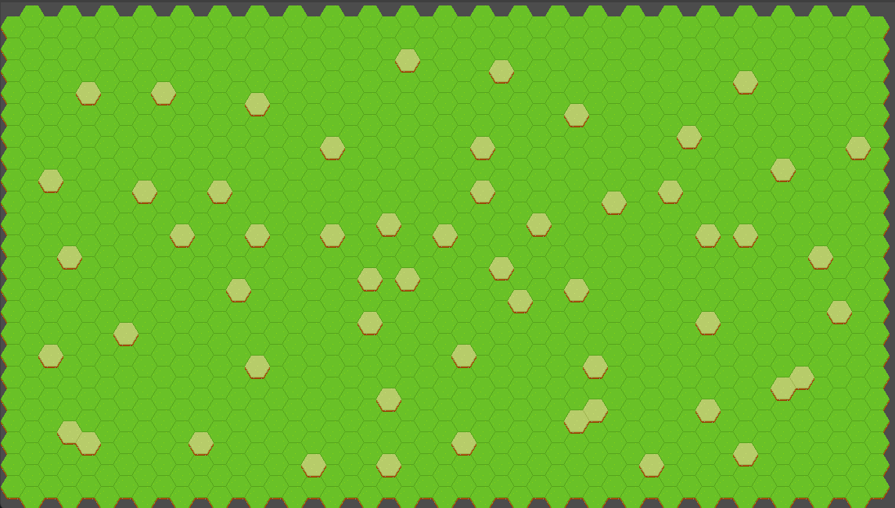
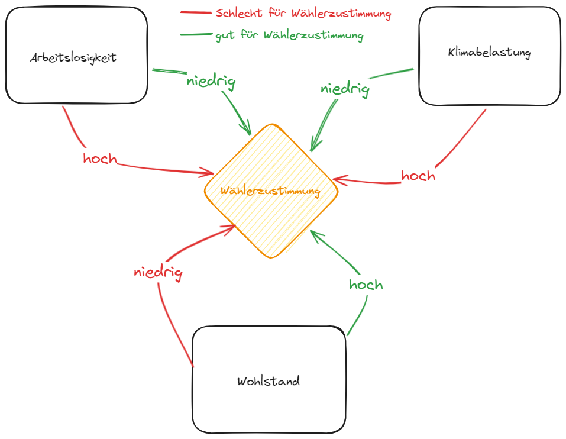
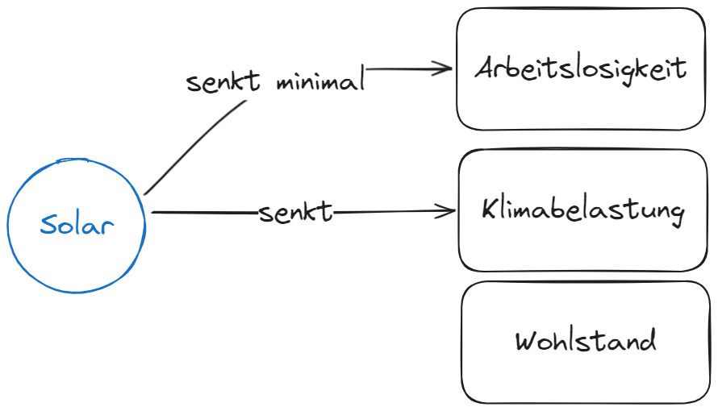
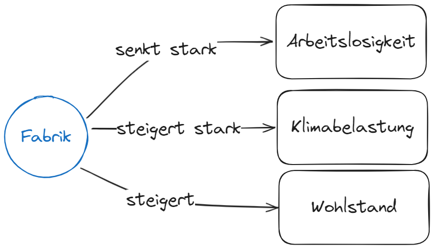
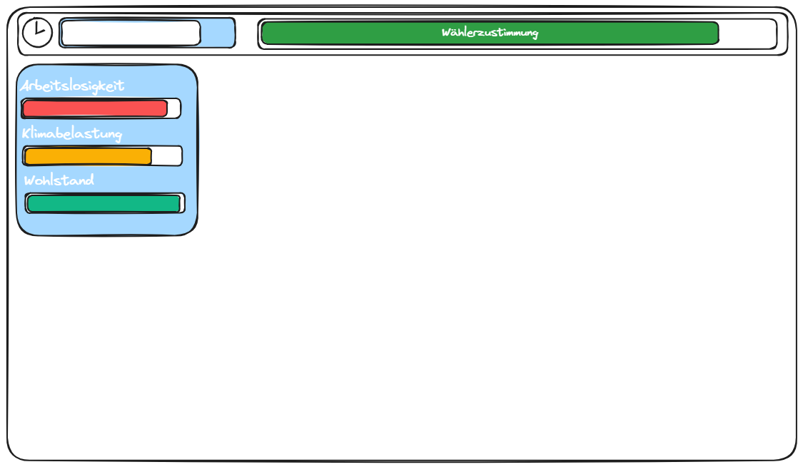

# Polls And Pillars

**Dieser Stand ist noch nicht mit dem Main-Stand synchronisiert. Dieser Erfolgt nach der GamesJam**

Das Projekt ist entstanden im Zuge der [Spawnpoint GamesJam 2024](https://institut-spawnpoint.de/events/game-jam-2024/)

Es soll kein fertiges Produkt darstellen. Alle hier dargestellten Szenarien sind rein fiktional und spiegeln in keiner Weise die Realität wider.
Alle paralleln zu realen Ereignissen sind reiner Zufall.

## Grundidee
Name: Polls and Pillars

- Landschaft mit Baufläche, per Klick Gebäudeauswahl öffnen und platzieren  
- Jedes Gebäude gibt verschiedene Stats 
  - (für den Anfang Klima -- erweiterbar mit Wohlstand, Arbeitslosigkeit etc.)

### Grundfläche: 

#### Grundprinzip:
- Tilemap mit simpler Grafik, Bauplätze klickbar.
#### Erweiterungen: 
- Autogenerierung der Map, beispielsweise an die echte Welt angelehnt

### Flächenarten: 
#### Grundprinzip:
- Wiese (= freie Fläche)
- Bauplätze (= Flächen zum Platzieren)
#### Erweiterungen:
- Wald
- Hügel
- Meer

=> Bauplätze an diesen Orten haben besondere Gebäude 
  - Beispiele: 
    - Sägewerk
    - Mine
    - Ölbohrinsel
    - Förster
    - Solar
    - Offshore-Windkraft)

### Hauptleiste: 
#### Grundprinzip:
- Wählerschaft
  - sinkt, wenn die Klimaleiste zu niedrig

#### Erweiterungen: 
  - Wohlstand und Arbeitslosigkeit nehmen Einfluss auf Hauptleiste

### Mechanics / Zusammenwirkungen

- Arbeitslosigkeit steigt = Wählerzustimmung sinkt
- Arbeitslosigkeit sinkt = Wählerzustimmung steigt

- Wohlstand sinkt = Wählerzustimmung sinkt
- Wohlstand steigt = Wählerzustimmung steigt

- Klimabelastung sinkt = Wählerzustimmung sinkt
- Klimabelastung steigt = Wählerzustimmung steigt

- Arbeitslosigkeit steigt pro Jahr leicht bis stark (durch z.B.: Bevölkerungswachstum)

#### Module
##### Solar

##### Fabrik

## Weiterführende Ideen

### UI

## License

MIT

## Contributors

[@SirKyomi](https://github.com/SirKyomi)  
[@LeutnantJohn](https://github.com/LeutnantJohn)

